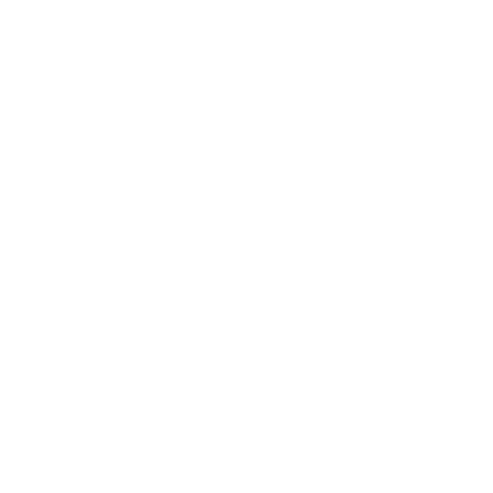
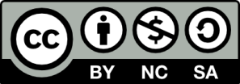

# αimgロゴ素材

[<kbd></kbd>](./WebP/Icon_Black.webp)
[<kbd></kbd>](./WebP/Icon_White.webp)
[<kbd></kbd>](./WebP/Icon_Blue.webp)
[<kbd></kbd>](./WebP/Icon_Pink.webp)

# αimgロゴの使用について

## αimg 公式ロゴは以下のライセンス許諾の元使用可能です

> [Creative Commons BY-NC-SA 4.0 (クリエイティブ・コモンズ 表示 - 非営利 - 継承 4.0 国際)][cc] 
> (C) 2026 nijiurachan contributors

[][cc]

## 下記の項目に従い使用してください

- 基本は黒/白/青/桃の4色ですが独自の色やグラデーションなどを使用可能です。目指せ10億7千万色（好きなだけ色増殖が可能です）
- 目と口は顔文字のように改変して使用できます。（マジックペンで描いたようなタッチを推奨します）
- 意匠とライセンスが守られている範囲での改変や装飾は歓迎します。
- ロゴとそれを使用したグッズや商品で収益を得ない場合に限り利用・再配布が可能です。

## 下記の行為は禁止しています

> [!IMPORTANT]
> - ロゴを使用しての法に触れる行為や反社会的行動、ヘイトまたこれにまつわる扇動や斡旋行為を禁止します。
> - ロゴの権利を保有していない個人や団体がグッズとして販売し収益を得ることを禁止します。
> - ライセンスを改変して再配布することを禁止します。

[cc]: https://creativecommons.org/licenses/by-nc-sa/4.0/deed.ja
